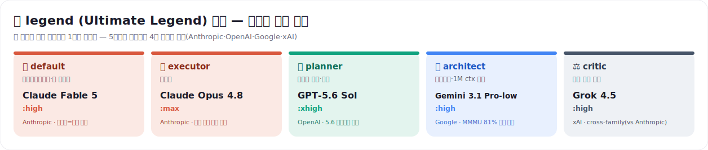
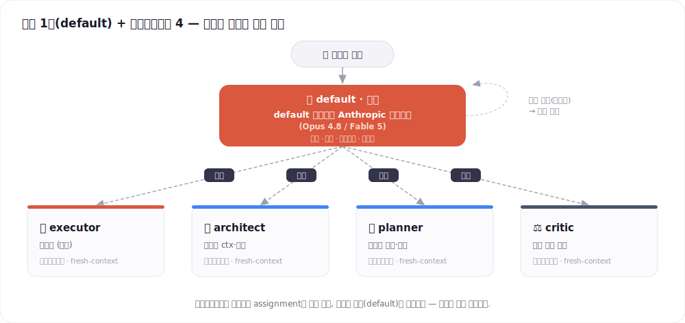
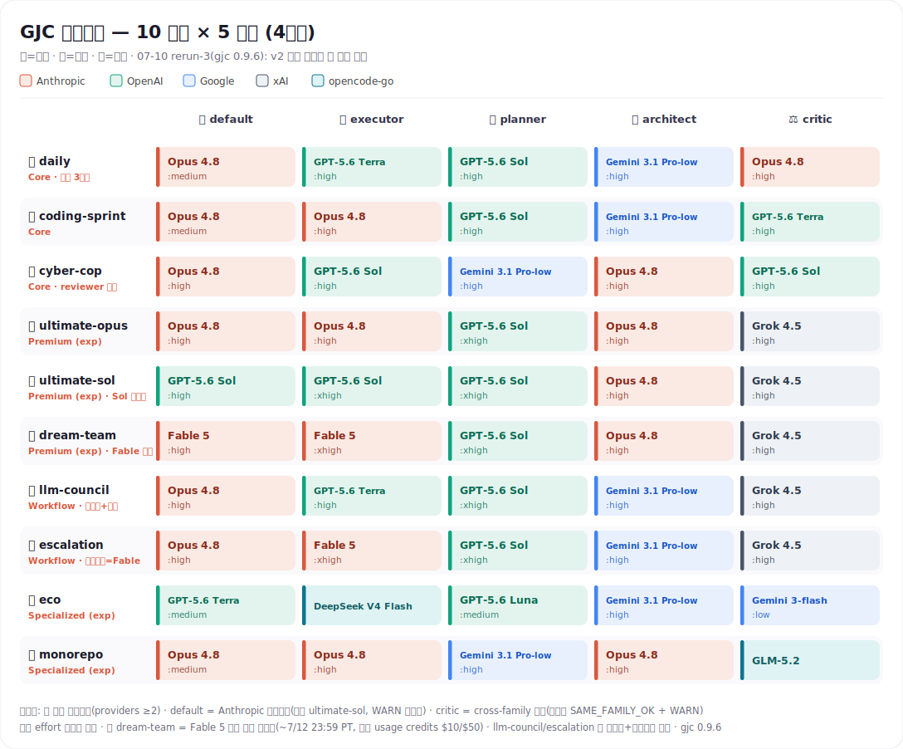
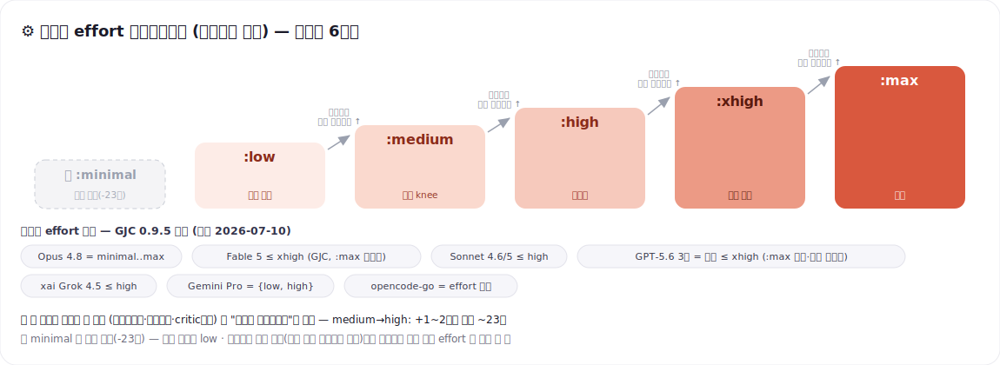

<div align="center">

# 🧩 GJC マルチベンダー究極セットアップ

### claude · gpt · grok · gemini · opencode go — 5つの契約を*役割ごと*に振り分ける検証済み構成

モデル選びで悩むのをやめよう。**ワンライナーでインストール**し、各役割に最適なモデルを自動で割り当てる。

[-e23?style=flat-square)](https://github.com/Yeachan-Heo/gajae-code)
[](./CHANGELOG.md)
[](https://github.com/Yeachan-Heo/gajae-code/pull/860)




</div>

**[한국어](./README.md) · [English](./README.en.md) · [中文](./README.zh.md) · 日本語（このページ）**

> [!NOTE]
> 役割・セレクタの中核概念は [GJC 公式ドキュメント](https://github.com/Yeachan-Heo/gajae-code/blob/dev/docs/multi-vendor-profiles.md) に上流マージ済み（[PR #860](https://github.com/Yeachan-Heo/gajae-code/pull/860)、`dev`）。本リポジトリはワンクリック導入、4階層10バンドルのカタログ、[保守・検証ツール](./MAINTAINING.md)を提供する。

---

## ⚡ 30秒インストール

```bash
curl -fsSL https://raw.githubusercontent.com/project820/gjc-multivendor-setup-guide/main/install.sh | bash
```

この1行で **10 個のバンドルを `~/.gjc/agent/models.yml` に安全にマージ**し、既定プロファイルを `daily` に設定する。既存設定は自動バックアップされ、再実行してもクリーンに更新される。

```bash
gjc --mpreset daily        # このセッションのみ
gjc                        # 新規セッションは自動で daily
```

> [!IMPORTANT]
> **インストール後、各プロバイダへのログインが必要。** GJC OAuth はネイティブ `agy`/`grok` CLI のログインと共有されない。GJC で各コマンドを一度実行する:
>
> ```text
> /login anthropic           # claude
> /login openai-codex        # gpt（ChatGPT アカウント → base GPT を提供）
> /login google-antigravity  # gemini（Google AI Pro/Ultra サブスク）
> /login xai                 # grok 全ラインナップ + Composer
> ```
> opencode-go は API キー方式：`/provider add` または環境変数 `OPENCODE_API_KEY`。認証状態は `/provider` で確認。

> [!TIP]
> 既定プロファイル指定：`curl -fsSL …/install.sh | GJC_SETUP_DEFAULT=ultimate-opus bash` · 既定設定をスキップ：`GJC_SETUP_DEFAULT=none`。

---

## 🧭 どのバンドルを使うか？

| Tier | バンドル | 一言定義 | こんな時 |
|---|---|---|---|
| Core | ⭐ **daily** | 本体 Opus + 委譲役割別に分散 — **サブスク OAuth 3 ベンダーだけで activation** | **日常の既定** |
| Core | 🏎️ **coding-sprint** | executor を Opus に昇格した実装スループット特化 | 純粋な実装スプリント |
| Core | 🚨 **cyber-cop** | reviewer モード — architect·critic が主役 | PRレビュー・セキュリティ監査 |
| Premium (exp) | 🏆 **ultimate-opus** | Anthropic 品質基盤のプレミアム | 正確性がコストより重要 |
| Premium (exp) | 🧪 **ultimate-sol** | Sol 基盤のプレミアム — agentic/terminal/browser 軸 | 長期自律ワークフロー実験 |
| Premium (exp) | 🔥 **dream-team** | 役割別最強仮説 — Fable default+executor | 最高品質、credits 覚悟 |
| Workflow | 🏛️ **llm-council** | 4 系列の座席表と Council 契約 | 多系列合意が必要な決定 |
| Workflow | 🛡️ **escalation** | 手動エスカレーション — Fable 救援投手 + critic 3票パネル | 不可逆変更 |
| Specialized (exp) | 💸 **eco** | マルチベンダー低単価実験 — *絶対最安ではない* | コスト圧・大量作業 |
| Specialized (exp) | 🗺️ **monorepo** | 全域 ≥1M ctx | 巨大コードベース |

全カタログは [§5](#5-️-最終カタログ--10-バンドル--4階層) · reviewer モードとティーザーは以下を参照。

> **🚨 cyber-cop** — GJC 初の reviewer モード: architect·critic が主役で、executor は再現の脇役。高リスク PR は3票パネルで判定し、PR #4〜#7 でマージ前の欠陥10件を遮断した。
> インストール: `curl -fsSL …/install.sh | GJC_SETUP_COP=1 bash` → `gjc-cop 123`
> → [アナウンス文書](./docs/whats-new-cyber-cop.md)

> **Extragoal — GPT-5.5 Pro 最終レビューレーン（opt-in）** — Pro の深い推論を開発・QA・セキュリティ点検の最終判定席に投入する。上流の基本レーンはこれ無しでも動作し、`GJC_SETUP_EXTRAGOAL=1` で導入する。
> → [Extragoal Maximalist 文書](./docs/extragoal-maximalist.md)

---

## 1. 🎯 なぜマルチベンダーか

| 役割 | 何をするか | 最適モデル |
|---|---|---|
| 🧠 **推論・設計**（planner） | 手順・受け入れ基準 | **GPT-5.6 Sol**（Agents' Last Exam 52.7 · 2026-07-09 GA） — 席は [§5](#5-️-最終カタログ--10-バンドル--4階層) を参照（例外：cyber-cop・monorepo=Gemini、eco=Luna） |
| 🔨 **実装**（executor） | 実際のコード作成・修正 | **Claude Fable 5**（SWE-bench Verified **95.0**）— サブスク込み最強は **Opus 4.8**（88.6） |
| 🔭 **コードレビュー**（architect） | 大規模リポ探索・アーキ | **Gemini 3.1 Pro**（マルチモーダル MMMU-Pro 81%） · 超長文脈（>200k）→ **Opus** |
| ⚖️ **独立批評**（critic） | 敵対的検証 | **クロスファミリー**（メインループと別ベンダー） |
| 🎛️ **オーケストレーション**（default） | ツール呼び出し・ルーティング・誠実性 | **Anthropic フラッグシップ** — Opus 4.8（`dream-team` は Fable 5。非 Anthropic は `ultimate-sol`（Sol）と `eco`（Terra）のみ） |

---

## 2. 🧭 コア設計

> **強いメインループを1つ固定（default = Anthropic フラッグシップ Opus/Fable）+ シグナル駆動の委譲 + 失敗駆動の effort エスカレーション。**

<div align="center">

</div>

3つの設計原則：

- **メインループは絶対に譲らない。** 中央値のタスクはほぼメインループが単独処理するため、`default` を弱モデルに落とすと体感品質が全面崩壊する。基本は Anthropic フラッグシップ（Opus 4.8 — `dream-team` は Fable 5）。非 Anthropic ルータは `ultimate-sol`（Sol）と `eco`（Terra）のみ。
- **多様性は「検証」でのみ効く。** `critic` はメインループと別ベンダーにして独立性を確保する。ただし直列チェーンは短く保つ（信頼性は `0.99ⁿ` で減衰）。
- **effort は非対称な経済学。** `medium→high` は +1〜2点のためにトークン約23倍。無条件 `max` は無駄 — 解けなかったときだけ上げる。

---

## 3. 🔧 GJC エンジンの事実

### 3-1. 5つの役割

| 役割 | 実行場所 | 最優先能力 |
|---|---|---|
| `default` | **メインループ** | ツール呼び出し信頼性 · 誠実性 |
| `executor` | サブエージェント（`task` 委譲時のみ） | 実コーディング（SWE-bench） |
| `architect` | サブエージェント | 大文脈 · マルチモーダルレビュー |
| `planner` | サブエージェント | 最上位の推論 · 手順化 |
| `critic` | サブエージェント | 独立した敵対的批評 |

### 3-2. Effort チートシート

**GJC 0.9.6 の実効値**（2026-07-10 実呼び出しバッテリー）であり、API 公式仕様と異なる箇所がある：

```text
Opus 4.6/4.7/4.8        minimal low medium high xhigh max   ← 全6段
Fable 5                 minimal low medium high xhigh       ← :max は xhigh へサイレントクランプ
Sonnet 4.6 / 5          minimal low medium high              ← :xhigh/:max は high へサイレントクランプ
GPT 5.4 / 5.5 (base)    low medium high xhigh                ← 5.5 既定 xhigh
GPT 5.6 Sol/Terra/Luna  low medium high xhigh (max)          ← :max は受理されるが深度未検証 — 出荷上限 xhigh
Grok 4.5（xai）          low medium high                      ← :xhigh/:max は high へサイレントクランプ
grok-build/grok-4.3     ── bare セレクタのみ（effort サフィックス非解釈）──
opencode-go deepseek-v4  minimal low medium high xhigh
opencode-go その他       ── effort サフィックス省略（既定）──
google-antigravity Gemini  gemini-3.1-pro-low:high（高推論）· gemini-3.1-pro-low（低 effort）
```

### 5つのハードルール

1. Gemini Pro は `low`/`high` のみ — 高推論は `gemini-3.1-pro-low:high` をリテラルにピン（0.9.6 からファジー空間は fail-closed）。
2. openai-codex の文脈はモデル別 — `gpt-5.4`=1M · `gpt-5.5`=272K · `gpt-5.6 3種`=373K。
3. Sonnet（4.6/5）は `xhigh`/`max` 不可 · **Fable 5 は `max` 不可**（それぞれ high/xhigh にクランプ）。
4. opencode-go は `:effort` を省略（deepseek-v4 系のみ例外）。
5. xai `grok-4.5` の上限は `high`。gpt-5.6 3種の `:max` は受理されるが深度未検証のため出荷上限は `xhigh`。

> **脚注（上流ギャップ）**：Claude 5 ファミリーは API 公式には両方とも `max` まで対応する。GJC パーサ（0.9.1~0.9.6）の fable フォールバック・sonnet-5 の 4.6 クランプ継承はエンジン側のギャップで、再現資料と共に上流へ報告済み。

### 3-3. 契約 → プロバイダ

| 契約 | provider-id | 備考 |
|---|---|---|
| claude | `anthropic` | 全 effort。Claude 5 ファミリー（Fable 5·Sonnet 5）を含む |
| gpt | `openai-codex` | **ChatGPT アカウント → base GPT（gpt-5.6 sol/terra/luna · 5.5 · 5.4）を提供**。ctx: 5.4=1M · 5.5=272K · 5.6=373K |
| grok | `xai` | 全ラインナップ + Composer |
| gemini | `google-antigravity` | **Google AI Pro/Ultra サブスクトークン**。Gemini + 同梱 Claude（Opus 4.6 — 2026-07-02 時点） |
| opencode go | `opencode-go` | API キー（`OPENCODE_API_KEY`） |

> [!NOTE]
> ChatGPT（Codex）は base GPT のみを提供し、単体の `-codex` 派生は未対応。`google-vertex`・DeepInfra は API キーの有料代替である。

### 3-4. セレクタ構文

```text
<provider-id>/<model-id>:<effort>            例）anthropic/claude-opus-4-8:high
google-antigravity/gemini-3.1-pro-low:high   （Gemini 高推論 — エンジン公式経路）
opencode-go/<model>                           （effort 省略 = モデル既定）
```

---

## 4. 📊 ベンチマーク根拠

| 役割（軸） | 首位 | 数値 |
|---|---|---|
| executor（SWE-bench Verified） | **Fable 5** | **95.0%**（Opus 4.8 88.6 = **サブスク込み最強** · GPT-5.5 82.6 · Gemini 3.1 Pro 80.6） |
| planner（長期ワークフロー・推論） | **GPT-5.6 Sol**† | Agents' Last Exam 52.7（5.5：46.9）· AA Intelligence 58.9 — 科学知識特化は Gemini 3.1 Pro の 94.3（[役割配置の検討](./docs/deep-dive-role-fit.md#6-2-역할-배치-최적성-검토-deep-research--실측)） |
| architect（文脈・マルチモーダル） | **Gemini 3.1 Pro**† | 1M 文脈 · MMMU-Pro 81% |
| default（ツール呼び出し・誠実性） | **Opus 4.8 / Fable 5** | ルータ品質 = 全体の上限（Fable は [§5](#5-️-最終カタログ--10-バンドル--4階層) のキャベアットに注意） |
| critic（独立性） | **クロスファミリー** | メタ審判 > 討論型集計 |

**合意原則** — † planner は 2026-07-10 の Sol GA を反映して Gemini 3.1 Pro スナップショットを置換し、architect 軸は Gemini 3.5 Pro リリース時に再検証する。

1. **default = Anthropic フラッグシップ（Opus/Fable）固定** — 例外は `ultimate-sol`（Sol）と `eco`（Terra）のみ。
2. **architect = Gemini 3.1 Pro（マルチモーダル）/ Opus（超長文脈）** — 200k+ の検索は Opus（MRCR 76%@1M、Gemini は 26%）。
3. **critic = クロスファミリー** — メインループ/プランナーと別ベンダーにする。
4. **構造 = 強メインループ + シグナル駆動委譲 + 失敗駆動 effort エスカレーション。**
5. **クエリ毎のプロファイル切替 ❌** — キャッシュ損失 > 利得。モード境界でのみ切替。

---

## 5. 🗂️ 最終カタログ — 10 バンドル · 4階層

<div align="center">

</div>

> ★ = 日常推奨。v2.0.0 は同等なプロファイル群ではなく 4階層の10バンドルである。全バンドルは `required_providers ≥ 2`、基本 `critic=cross-family`（例外は `SAME_FAMILY_OK`+WARN）、エンジン effort ハードルールとセレクタ検証（[§6](#6--検証マトリクス)）に従う。2026-07-10 の gjc **0.9.6** バッテリーで出荷席はグリーンだった。

<details>
<summary><b>📋 完全な YAML を展開（モデルマッピングは gjc-profiles.yml と同一 — コメントは除去済み。注釈付きの韓国語正本は <a href="./gjc-profiles.yml">gjc-profiles.yml</a>）</b></summary>

```yaml
profiles:

  daily:
    required_providers: [anthropic, openai-codex, google-antigravity]
    model_mapping:
      default:   anthropic/claude-opus-4-8:medium
      executor:  openai-codex/gpt-5.6-terra:high
      planner:   openai-codex/gpt-5.6-sol:high
      architect: google-antigravity/gemini-3.1-pro-low:high
      critic:    google-antigravity/gemini-3.1-pro-low:high

  coding-sprint:
    required_providers: [anthropic, openai-codex, google-antigravity]
    model_mapping:
      default:   anthropic/claude-opus-4-8:medium
      executor:  anthropic/claude-opus-4-8:high
      planner:   openai-codex/gpt-5.6-sol:high
      architect: google-antigravity/gemini-3.1-pro-low:high
      critic:    openai-codex/gpt-5.6-terra:high

  cyber-cop:
    required_providers: [anthropic, openai-codex, google-antigravity]
    model_mapping:
      default:   anthropic/claude-opus-4-8:high
      executor:  openai-codex/gpt-5.6-sol:high
      planner:   google-antigravity/gemini-3.1-pro-low:high
      architect: anthropic/claude-opus-4-8:high
      critic:    openai-codex/gpt-5.6-sol:high

  ultimate-opus:
    required_providers: [anthropic, openai-codex, xai]
    model_mapping:
      default:   anthropic/claude-opus-4-8:high
      executor:  anthropic/claude-opus-4-8:high
      planner:   openai-codex/gpt-5.6-sol:xhigh
      architect: anthropic/claude-opus-4-8:high
      critic:    xai/grok-4.5:high

  ultimate-sol:
    required_providers: [openai-codex, anthropic, xai]
    model_mapping:
      default:   openai-codex/gpt-5.6-sol:high
      executor:  openai-codex/gpt-5.6-sol:xhigh
      planner:   openai-codex/gpt-5.6-sol:xhigh
      architect: anthropic/claude-opus-4-8:high
      critic:    xai/grok-4.5:high

  dream-team:
    required_providers: [anthropic, openai-codex, xai]
    model_mapping:
      default:   anthropic/claude-fable-5:high
      executor:  anthropic/claude-fable-5:xhigh
      planner:   openai-codex/gpt-5.6-sol:xhigh
      architect: anthropic/claude-opus-4-8:high
      critic:    xai/grok-4.5:high

  llm-council:
    required_providers: [anthropic, openai-codex, google-antigravity, xai]
    model_mapping:
      default:   anthropic/claude-opus-4-8:high
      executor:  openai-codex/gpt-5.6-terra:high
      planner:   openai-codex/gpt-5.6-sol:xhigh
      architect: google-antigravity/gemini-3.1-pro-low:high
      critic:    xai/grok-4.5:high

  escalation:
    required_providers: [anthropic, openai-codex, google-antigravity, xai]
    model_mapping:
      default:   anthropic/claude-opus-4-8:high
      executor:  anthropic/claude-fable-5:xhigh
      planner:   openai-codex/gpt-5.6-sol:xhigh
      architect: google-antigravity/gemini-3.1-pro-low:high
      critic:    xai/grok-4.5:high

  eco:
    required_providers: [openai-codex, opencode-go, google-antigravity]
    model_mapping:
      default:   openai-codex/gpt-5.6-terra:medium
      executor:  opencode-go/deepseek-v4-flash
      planner:   openai-codex/gpt-5.6-luna:medium
      architect: google-antigravity/gemini-3.1-pro-low:high
      critic:    google-antigravity/gemini-3-flash:low

  monorepo:
    required_providers: [anthropic, google-antigravity, opencode-go]
    model_mapping:
      default:   anthropic/claude-opus-4-8:medium
      executor:  anthropic/claude-opus-4-8:high
      planner:   google-antigravity/gemini-3.1-pro-low:high
      architect: anthropic/claude-opus-4-8:high
      critic:    opencode-go/glm-5.2
```

</details>

<details>
<summary><b>v1.11 → v2 マイグレーション</b></summary>

`ultimate`→`ultimate-opus`、`ultimate-f5`/`legend`→`dream-team`。`llm-council`・`ultimate-sol` は新設された。`solo-anthropic`/`solo-openai`/`claude-codex`/`claude-codex-max` は v2 のマルチベンダー原則で削除し、対応する用途は GJC 0.9.6 内蔵の `claude-*`・`codex-*`・`opus-codex`・`fable-opus-codex` が吸収する（マッピング等価ではない）。詳細は [CHANGELOG](./CHANGELOG.md) と [v2 案内](./docs/whats-new-v2.md)を参照。

</details>

カタログ全体は韓国語正本の[§5](./README.md#5-️-최종-카탈로그--10-번들--4계층)、プロファイル別の設計根拠と `opencode-go` の補足は[設計根拠](./README.md#프로필별-설계-근거)を参照。

---

## 6. ✅ 検証マトリクス

> 凡例: ✅ 実呼び出しグリーン（括弧内は検証日）· 🔴 失敗 · ⚠ 注意/クランプ · †‡ 脚注 · ●○ 相対コスト。
> 2026-07-10 の gjc **0.9.6** で全プロバイダの核心セレクタを `gjc -p --no-session --no-tools --model <sel> "..."` で実呼び出しした（[rerun-3](./evidence/2026-07-10-selectors-rerun-3.md)、0.9.5 の記録は rerun-2）。v2 出荷席はすべてグリーンで、当日の antigravity ドリフトで eco.critic を差し替えた。

| プロバイダ | 検証済みセレクタ |
|---|---|
| `anthropic` | `claude-fable-5:high`/`:xhigh` · `claude-sonnet-5:high` · `claude-opus-4-8:high` · `claude-sonnet-4-6:high` — sel ✅(07-10) |
| `openai-codex` | `gpt-5.6-sol:medium`/`:high`/`:xhigh` · `gpt-5.6-terra:high`/`:xhigh` · `gpt-5.6-luna:high` · `gpt-5.5:high` · `gpt-5.4:high` — sel ✅(07-10; 5.5=07-02) |
| `xai` | `grok-4.5:medium`/`:high` · `grok-4-fast:high` · `grok-4-1-fast:high` · `grok-code-fast-1` · `grok-composer-2.5-fast` — sel ✅(07-10; 4-1 retired) |
| `grok-build` | `grok-4.3`（bare）— sel ✅(07-02) |
| `google-antigravity` | `gemini-3.1-pro-low`/`:high` · `gemini-3-flash`/`:low` — sel ✅(07-10) |
| `opencode-go` | `deepseek-v4-flash` · `deepseek-v4-pro` · `glm-5.2` · `glm-5.1` · `minimax-m2.7` · `qwen3.7-max` · `kimi-k2.6` · `mimo-v2.5` — sel ✅(07-02) |

- `fable-5:max`→xhigh、`sonnet-5:xhigh/max`→high、`grok-4.5:xhigh/max`→high は失敗でなくサイレントクランプ。
- GPT-5.6 3種の `:max` は受理されるが深度未検証で未出荷、`gpt-5.5:high` は 07-02 グリーンのカナリア。
- `grok-4-1-fast` は 2026-05-15 retire 後に grok-4.3 料金へ redirect されるため v2 から除外した。
- 0.9.6 以降の Gemini ファジー空間は fail-closed。`gemini-3.1-pro-high` の 0.9.5 サイレント `-low` 解釈は再現されない。
- `glm-5.2` は 0.7.10 からバンドル入りし、`OPENCODE_API_KEY` が必要。

<details>
<summary><b>失敗したセレクタ（回避）</b></summary>

- `openai-codex/gpt-5.3-codex` · `gpt-5.2-codex` · `gpt-5.1-codex-max/mini` — ChatGPT アカウント非対応。
- `google-antigravity/gemini-3.1-pro-high` — 0.9.6 では not found。高推論は `gemini-3.1-pro-low:high`。
- `gemini-3.5-flash-low` · `gemini-3.5-flash` · `gemini-pro-agent` — 2026-07-10 午後に not found。
- `gemini-3-pro` — 廃止。
- `claude-sonnet-4-6-thinking` — 404。
- `gpt-oss-120b` — 500。
- `opencode-go/*` — `OPENCODE_API_KEY` 未設定時に失敗。

</details>

> [!NOTE]
> antigravity のライブ面は当日中にも変わり、`--list-models` 表記はキャッシュの場合がある。席に採用する前に実呼び出しで確認し、ディスカバリ未更新なら再ログイン/再試行またはバンドル id を使う（eco critic の代替は `opencode-go/deepseek-v4-pro`、GLM は `zai/glm-5.2` と `zai` プロバイダ追加）。

<details>
<summary><b>レイテンシ参考（マイクロベンチ 2026-07-02; Grok 4.5 は 2026-07-09 streaming）</b></summary>

| セレクタ | コーディング | 推論 | 備考 |
|---|---|---|---|
| `sonnet-5:medium` / `:high` | **3.1s** / 3.5s | 3.5s / 3.4s | **全体最速** |
| `opus-4-8:high` | 4.0s | 3.9s | |
| `fable-5:medium`~`:max(→xhigh)` | 6.7~7.7s | 3.5~6.3s | コーディングで sonnet-5 比 +3~4s |
| `grok-4.5:medium` / `:high` | ~14s / ~50s | TTFT ~13s / ~48s | high は高リスク critic 専用 |
| `deepseek-v4-flash` | 4.6s | 5.5s | |
| `gemini-3.1-pro-low:high` | **17.4s** | 5.7s | コーディング遅延の外れ値 |
| `glm-5.2` | **21.9s** | 4.0s | コーディング最遅 — critic には支障なし |

</details>

```bash
gjc -p --no-session --no-tools --model "anthropic/claude-fable-5:high" "Reply exactly: OK"
gjc -p --no-session --no-tools --model "google-antigravity/gemini-3.1-pro-low:high" "Reply exactly: OK"
gjc -p --no-session --no-tools --model "openai-codex/gpt-5.6-terra:high" "Reply exactly: OK"
```

v1 の3本の独立ディープリサーチ（GPT-5.5 · Claude Opus 4.8 · Gemini 3.1 Pro）と v2 の2軸ブラインド独立リサーチ（Claude Fable 5 Ultracode · Parallel.ai Ultra 2x、2026-07-10）の相互検証により、役割→モデル配置は near-optimal と確認された。役割配置と残余ギャップの深掘りは、韓国語のみの [docs/deep-dive-role-fit.md](./docs/deep-dive-role-fit.md) を参照。

---

## 7. 🛠️ インストール / アンインストール

[§30秒インストール](#-30秒インストール)の導入とログインに従う。

```bash
# オプション
curl -fsSL …/install.sh | GJC_SETUP_DEFAULT=ultimate-opus bash  # 既定プロファイル指定
curl -fsSL …/install.sh | GJC_SETUP_DEFAULT=none bash        # 既定設定をスキップ
curl -fsSL …/install.sh | GJC_CODING_AGENT_DIR=/path bash    # agent ディレクトリ上書き
```

### 手動インストール / 検証 / アンインストール

[`gjc-profiles.yml`](./gjc-profiles.yml) の `profiles:` ブロックを `~/.gjc/agent/models.yml` に貼り付け、`gjc --mpreset daily --default`。

```bash
gjc --list-models daily                       # 確認
cp ~/.gjc/agent/models.yml.bak-*  ~/.gjc/agent/models.yml   # 巻き戻し（バックアップ復元）
```

> [!WARNING]
> **GJC 0.7.10~0.9.1 のプリセット rename/delete に注意**：カスタムプリセットの rename/delete は `models.yml` のコメントを全て除去し、インストーラ管理ブロックのセンチネルも失われる。削除済みプロファイルが再インストール時に復活しうるため結果を確認すること。完全な除去はバックアップ復元（`cp … .bak-*`）が最も確実で、0.9.6 では未再検証。

---

## 8. 🔀 動的ルーティング

> [`routing-rules.md`](./routing-rules.md)（韓国語のみ — セレクタ/プロファイル名は言語非依存）をプロジェクトの `AGENTS.md` に入れるか、`gjc --append-system-prompt @routing-rules.md` で注入する。

<div align="center">

</div>

**作業シグナル → 委譲** — 委譲はシグナルが明確なときだけ。メインループが直接できるなら直接やる。

<div align="center">

</div>

**effort ラダー** — 解けなかったから上げるのは正当 · 下限は low · Gemini は low↔high の単一ジャンプ。

| シグナル | 切替 → |
|---|---|
| セッション開始・一般作業 | `daily` |
| 純粋な実装スプリント | `coding-sprint` |
| マージ/リリース前・セキュリティ・決済 | `escalation`（手動トリガー — routing-rules の Escalation 契約） |
| PR レビュー・セキュリティ監査セッション | `cyber-cop` |
| 多系列合意が必要な決定 | `llm-council`（+ routing-rules の Council 契約） |
| 精度最優先（opt-in premium） | `ultimate-opus` / `ultimate-sol`（Sol 軸実験） / `dream-team`（Fable・credits 覚悟） |
| 大量リファクタ・マイグレーション | `eco` |
| 巨大コードベースへ突入 | `monorepo` |
| 単一ベンダーのみで運用 | GJC 内蔵プロファイル（`claude-opus`・`codex-*` など — このカタログ外） |

---

## 9. 🧪 並列エージェント + 信頼性

```text
直列5段階（各 0.99）：0.99^5 ≈ 95.1%   /   並列独立5個（OR 成功）：1-(0.01)^5 ≈ 100%
```

- critic は**メインループと別ベンダーで、並列独立投票後にメインループが集計**（討論禁止 — メタ審判が優位）。
- critic パネル例：`{openai-codex/gpt-5.6-sol:high, xai/grok-4.5:high, google-antigravity/gemini-3.1-pro-low:high}` を同時実行 → 2/3 反対または CRITICAL/BLOCK 1件なら遮断。**CRITICAL/HIGH dissent は多数決で棄却不可** — 解消または human gate。
- executor の fan-out は**作業が真に独立**（共有状態なし）なときだけ。
- チェーンは短く、メインループを単一の真実源にする（サブ同士で直接合意させない）。

---

## 10. 💰 コスト

Gemini は [Google AI Pro/Ultra](https://antigravity.google/docs/plans) のサブスクトークン、他は per-token 課金（$/1M、入力/出力）。Fable のサブスク込み・credits のキャベアットは §5 を参照。

| モデル | $/1M (in/out) | 役割 |
|---|---|---|
| Claude Fable 5 | 10 / 50（バッチ 5/25 · キャッシュヒット 1）† | dream-team default·executor · escalation executor |
| Claude Opus 4.8 | 5 / 25 | default·executor の基幹 |
| Claude Sonnet 5 | 3 / 15（イントロ 2/10 ~2026-08-31）‡ | eco executor 代替 |
| GPT-5.6 Sol | 5 / 30（Fast モードは 12.5/75） | planner（daily·sprint·ultimate-opus·dream-team·council·escalation）· ultimate-sol 3席 · cyber-cop executor·critic |
| GPT-5.6 Terra | 2.5 / 15 | daily executor · coding-sprint critic · llm-council executor · eco default |
| GPT-5.6 Luna | 1 / 6 | eco planner（v2 新規採用） |
| Grok 4.5 | 2 / 6（実効入力約 $0.84 @88% cache） | critic（premium 3種・llm-council・escalation）— xai API キー |
| GLM-5.2 (opencode-go) | 1.40 / 4.40 | monorepo critic |
| DeepSeek V4 Flash / Pro (opencode-go) | 0.14/0.28 · 1.74/3.48 | eco executor · >400k 単一 paste フォールバック |
| Gemini 3.1 Pro / 3-flash | プレビュー/サブスクトークン | planner·architect·critic |

> † Fable 5 は Opus のちょうど2倍の単価。サブスク込み分（~7/12）も週次上限を消費する。
> ‡ Sonnet 5 は**トークナイザ変更で同一テキストが約30%多くトークン化**される — 実効コストは表示単価より高く見積もること。
> （参考：DeepSeek 系は DeepInfra プロバイダ（API キー）経由なら V4 Pro $1.30/$2.60。）

**プロファイル相対コスト**

| プロファイル | コスト | 主因 |
|---|---|---|
| dream-team | ●●●●● | default·executor Fable 5 — ~7/12 サブスク込み（週次上限 50%）、以後 credits $10/50 |
| escalation | ●●●●● | executor Fable `:xhigh`（救援投手 — 間欠使用）+ planner Sol `:xhigh` + 4 ベンダー認証 |
| ultimate-opus / ultimate-sol | ●●●●○ | Opus または Sol 3席 `:high~xhigh` + Grok critic（xai API） |
| llm-council | ●●●●○ | 4 ベンダー認証 + Sol `:xhigh` planner — council 実行時は票数分課金 |
| coding-sprint | ●●●○○ | executor Opus `:high`（失敗シグナル時のみ max 昇格） |
| daily | ●●●○○ | 本体 Opus `:medium`、委譲は中・低価格へ分散 — サブスク OAuth 3ベンダー |
| monorepo | ●●●○○ | executor/architect Opus + Gemini（プレビュー/サブスク）+ GLM-5.2 |
| eco | ●○○○○ | executor DeepSeek V4 Flash（$0.14）+ Luna（$1）+ Gemini プレビュー — *絶対最安は内蔵 `codex-eco`* |

---

## 11. 📖 出典

**コーディング（executor）** · [Vals SWE-bench Verified](https://www.vals.ai/benchmarks/swebench) · [swebench.com](https://www.swebench.com/verified.html) · [Terminal-Bench 2.1](https://www.tbench.ai/leaderboard/terminal-bench/2.1)
**Claude 5 ファミリー** · [Fable 5 再デプロイ告知](https://www.anthropic.com/news/redeploying-fable-5) · [platform.claude.com モデルドキュメント](https://platform.claude.com/docs) — 価格・サブスク込み（~7/12 延長、[Android Authority 報道](https://www.androidauthority.com/claude-fable-5-free-extension-3685103/)）・effort 仕様を 2026-07-02/07-10 に相互確認
**GPT-5.6（2026-07-09 GA）** · [リリース発表](https://openai.com/index/gpt-5-6/) · [Sol プレビュー(Cerebras 750TPS)](https://openai.com/index/previewing-gpt-5-6-sol/) · [AA: GPT-5.6 has landed](https://artificialanalysis.ai/articles/gpt-5-6-has-landed) · [TechTimes(METR 評価ゲーミング)](https://www.techtimes.com/articles/319808/20260707/gpt-56-sol-review-faster-coding-half-fable-5-cost-benchmark-problem.htm) — 価格・評価を 2026-07-10 に相互確認
**役割・ルーティング** · [Gemini 3.1 Pro card](https://deepmind.google/models/model-cards/gemini-3-1-pro/) · [AA Index](https://artificialanalysis.ai/evaluations/artificial-analysis-intelligence-index) · [BFCL](https://gorilla.cs.berkeley.edu/leaderboard.html) · [self-preference bias](https://arxiv.org/abs/2410.21819) · [RouteLLM](https://www.lmsys.org/blog/2024-07-01-routellm/)
**公式モデル/価格** · [Anthropic](https://docs.anthropic.com/en/docs/about-claude/models) · [OpenAI](https://openai.com/api/pricing/) · [xAI](https://docs.x.ai/developers/models)

<div align="center">

**ワンライナーで導入、役割ごとに最適モデル。**
**v2.0.1** · [CHANGELOG](./CHANGELOG.md) · [保守プレイブック](./MAINTAINING.md) · ライセンス [CC BY 4.0](./LICENSE) · GJC = [Gajae Code](https://github.com/Yeachan-Heo/gajae-code)

</div>
