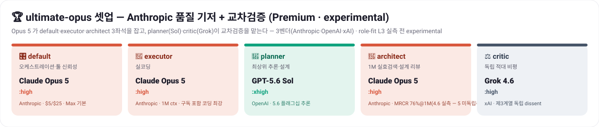
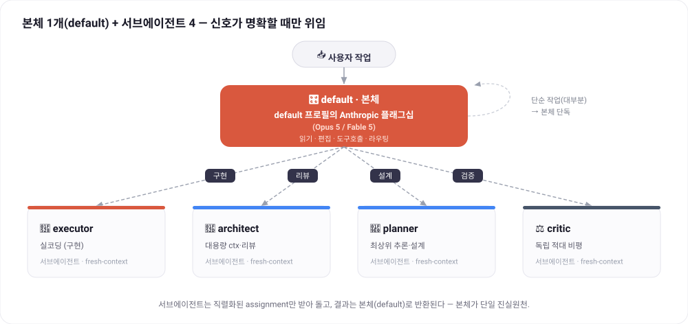
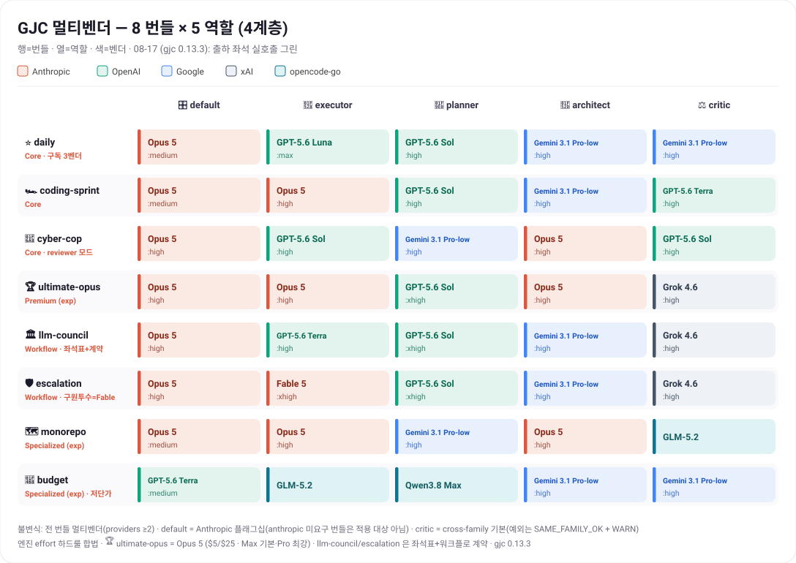
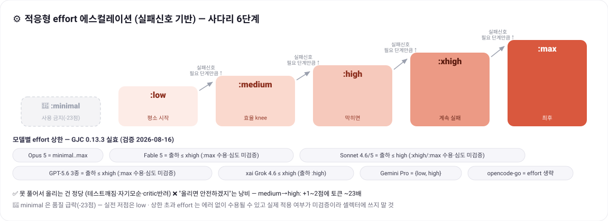

<div align="center">

# 🧩 GJC 多厂商极限配置

### claude · gpt · grok · gemini · opencode go — 把 5 个订阅*按角色*拆分使用的已验证配置

不用再纠结选哪个模型。**一行安装**，让每个角色自动用上最合适的模型。

[-e23?style=flat-square)](https://github.com/Yeachan-Heo/gajae-code)
[](./CHANGELOG.md)
[](https://github.com/Yeachan-Heo/gajae-code/pull/860)




</div>

**[한국어](./README.md) · [English](./README.en.md) · 中文（本页） · [日本語](./README.ja.md)**

> [!NOTE]
> 核心角色与选择器概念已合并至 [GJC 官方文档](https://github.com/Yeachan-Heo/gajae-code/blob/dev/docs/multi-vendor-profiles.md)（[PR #860](https://github.com/Yeachan-Heo/gajae-code/pull/860)，`dev`）。本仓库提供一键安装、4 层级 8 捆绑目录和[维护与验证工具](./MAINTAINING.md)。

> [!IMPORTANT]
> **Gemini 现在从 v3 目录中排除，只留在 `budget`。** 这不是质量比较，而是运营政策——本指南的读者已经能用到 xAI / Grok 4.6。默认路径（`daily`）及其他非 budget 捆绑没有 Gemini 席位。只留在低价车道（`budget`）。

---

## ⚡ 30 秒安装

```bash
curl -fsSL https://raw.githubusercontent.com/project820/gjc-multivendor-setup-guide/main/install.sh | bash
```

这一行会**把 8 个捆绑安全合并进 `~/.gjc/agent/models.yml`**，并把默认配置设为 `daily`。原有配置会自动备份，重复执行也会干净更新。

```bash
gjc --mpreset daily        # 仅本次会话生效
gjc                        # 新会话自动使用 daily
```

> [!IMPORTANT]
> **安装后必须登录各提供方。** GJC OAuth 不与原生 `agy`/`grok` CLI 登录共享；请在 GJC 中各执行一次：
>
> ```text
> /login anthropic           # claude
> /login openai-codex        # gpt（ChatGPT 账号 → 提供 base GPT）
> /login google-antigravity  # gemini（Google AI Pro/Ultra 订阅）
> /login xai                 # grok 全系列 + Composer
> ```
> opencode-go 使用 API key：`/provider add` 或环境变量 `OPENCODE_API_KEY`；用 `/provider` 查看认证状态。

> [!TIP]
> 指定默认配置：`curl -fsSL …/install.sh | GJC_SETUP_DEFAULT=ultimate-opus bash` · 跳过默认设置：`GJC_SETUP_DEFAULT=none`。

---

## 🧭 该用哪个捆绑？

**从你已有的订阅开始。** 不要先看 tier——先确定你**现在能用什么**。

下表左列是**某个捆绑实际运行所必需的最小提供方组合**。它直接转录自
规范 `gjc-profiles.yml` 的 `required_providers`，没有任意删减或补充。你的组合只要
**包含**某一行，即可使用该行的捆绑；若包含多行，即可使用这些行捆绑的**并集**。

| 最小所需组合 | 可用捆绑 |
|---|---|
| `anthropic` + `openai-codex` + `xai` | ⭐ **daily** · 🏎 **coding-sprint** · 🚨 **cyber-cop** · 🏆 **ultimate-opus** · 🛡 **escalation** · 🏛 **llm-council** |
| `anthropic` + `opencode-go` | 🗺 **monorepo** |
| `openai-codex` + `google-antigravity` + `opencode-go` | 💸 **budget** — 仍保留 Gemini 的唯一一行 |

### 认证方式是另一条轴

即使同样是“拥有”，取得方式也可能不同。补齐组合前先确认这一点。

| 提供方 | 取得方式 |
|---|---|
| `anthropic` · `openai-codex` · `google-antigravity` | `/login <provider>`——订阅登录 |
| `xai` | `/login xai` 或设置 `XAI_API_KEY` |
| `opencode-go` | `OPENCODE_API_KEY` |

> [!TIP]
> **`anthropic` + `openai-codex` + `xai`** 即可开启第一行——含 daily 在内的 6 个捆绑。`google-antigravity` 仅用于 `budget`。`opencode-go` 密钥解锁 monorepo 与 budget。

完整目录 ↓ [§5](#5-️-最终目录--8-个捆绑--4-层级)；reviewer 模式与预告见下方。

### tier 只是结果标签

Core / Premium / Workflow bundle / Specialized 只保留为各捆绑卡片的**徽章**；不再是“该用哪个捆绑”的首要依据——上面的表才是首要依据。

下表作为各捆绑具体内容的次要参考（tier 只是徽章，而非选择的首要方式）：

| Tier | 捆绑 | 一句话定义 | 何时用 |
|---|---|---|---|
| Core | ⭐ **daily** | Opus 主循环 + Grok critic — **无 Gemini**（政策；只留 `budget`） | **日常默认** |
| Core | 🏎️ **coding-sprint** | 把 executor 升到 Opus 的实现吞吐特化 | 纯实现冲刺 |
| Core | 🚨 **cyber-cop** | reviewer 模式 — architect·critic 主导，专用于 PR 审查·安全审计 | 审查他人 PR·合并门禁·安全审计 |
| Premium (exp) | 🏆 **ultimate-opus** | Anthropic 质量基底 premium | 精度比成本更重要 |
| Workflow | 🏛️ **llm-council** | 3 系列座位表（architect Opus 判定，default 只汇总）与 Council 契约 | 需要多系列共识的决策 |
| Workflow | 🛡️ **escalation** | 手动升级 — Fable 救援投手 + critic 2 票评审团 | 合并·安全·支付·不可逆变更 |
| Specialized (exp) | 💸 **budget** | 低成本多厂商实验 — *不是绝对最低价* | 成本压力·大批量 |
| Specialized (exp) | 🗺️ **monorepo** | 全局 ≥1M ctx | 巨型代码库 |

> **🚨 cyber-cop** — GJC 首个 reviewer 模式：architect·critic 是主角，executor 是复现配角。高风险 PR 使用两票评审团；PR #4~#7 曾在合并前拦截 10 个缺陷。
> 安装 wrapper：`curl -fsSL …/install.sh | GJC_SETUP_COP=1 bash` → `gjc-cop 123`
> → [公告文档](./docs/whats-new-cyber-cop.md)

> **Extragoal — GPT-5.5 Pro 最终审查通道（opt-in）** — 将 Pro 深度推理投入开发、QA 与安全检查的第 -1 轮判定席；上游默认通道不依赖它，以 `GJC_SETUP_EXTRAGOAL=1` 安装。
> → [Extragoal Maximalist 文档](./docs/extragoal-maximalist.md)

---

## 1. 🎯 为什么要多厂商

| 角色 | 做什么 | 最佳模型 |
|---|---|---|
| 🧠 **推理/规划**（planner） | 排序、验收标准 | **GPT-5.6 Sol**（Agents' Last Exam 52.7 · 2026-07-09 GA） — 各捆绑席位见[§5](#5-️-最终目录--8-个捆绑--4-层级)（例外：cyber-cop=Daybreak Blue，monorepo·budget=Qwen3.8 Max） |
| 🔨 **实现**（executor） | 真正写/改代码 | **Claude Fable 5**（SWE-bench Verified **95.0**）— 订阅内最强是 **Opus 5**（4.8 后继 · 同价 $5/$25 · 2026-07-24） |
| 🔭 **代码评审**（architect） | 大型仓库导航、架构 | **Gemini 3.1 Pro**（多模态 MMMU-Pro 81%） · 超长上下文（>200k）→ **Opus** |
| ⚖️ **独立批评**（critic） | 对抗式验证 | **cross-family**（与主循环不同厂商） |
| 🎛️ **编排**（default） | 工具调用、路由、诚实性 | **Anthropic 旗舰** — Opus 5（路由质量 = 全系统上限；非 Anthropic 路由仅限于**不要求 anthropic 的捆绑**，v3 中只有 `budget`（Terra）） |

---

## 2. 🧭 核心设计

> **固定一个强主循环（default = Anthropic 旗舰 Opus/Fable）+ 按信号委派 + 按失败信号升档 effort。**

<div align="center">

</div>

三条设计原则：

- **主循环绝不让步。** 默认使用 Anthropic 旗舰（Opus 5）。非 Anthropic 路由仅限于**不要求 anthropic 的捆绑**，v3 中只有 `budget`（Terra）— 规则根本不会触发，因此无需列入 allowlist。
- **多样性只在「验证」环节获益。** 让 `critic` 用不同厂商以保持独立，但串行链要短（可靠性按 `0.99ⁿ` 衰减）。
- **effort 是非对称经济学。** `medium→high` 只提升 1~2 分却要约 23 倍 token；只在解不出来时才升档。

---

## 3. 🔧 GJC 引擎事实

### 3-1. 五个角色

| 角色 | 运行位置 | 首要能力 |
|---|---|---|
| `default` | **主循环** | 工具调用可靠性 · 诚实性 |
| `executor` | 子代理（仅 `task` 委派时） | 真实编码（SWE-bench） |
| `architect` | 子代理 | 大上下文 · 多模态代码评审 |
| `planner` | 子代理 | 顶级推理 · 排序 |
| `critic` | 子代理 | 独立对抗式批评 |

### 3-2. Effort 速查表

**GJC 0.13.3 实际生效值**（2026-08-16 真实调用测试；与 API 官方规格存在差异）：

```text
Opus 5 / 4.8            minimal low medium high xhigh max   ← 全 6 档（出货席位为 Opus 5）
Fable 5                 minimal low medium high xhigh       ← :max 接受但深度未验证 — 出货上限 xhigh · thinking 常开
Sonnet 4.6 / 5          minimal low medium high              ← :xhigh/:max 接受但深度未验证 — 出货上限 high
GPT 5.4 / 5.5 (base)    low medium high xhigh                ← 5.5 默认 xhigh
GPT 5.6 Sol/Terra       low medium high xhigh (max)          ← :max 接受但深度未验证 — 出货上限 xhigh
GPT 5.6 Luna            max                                  ← v3 政策席位：D-1 强制仅 :max（非实测胜利）
Grok 4.6（xai）          low medium high xhigh                ← 出货上限 high（:xhigh 接受、深度未验证）
Grok 4.5（xai）          low medium high                      ← 遗留金丝雀
grok-build/grok-4.3     ── 仅裸选择器（effort 后缀不解析）──
opencode-go deepseek-v4  minimal low medium high xhigh
opencode-go 其他         ── 省略 :effort 后缀（用默认）──
google-antigravity Gemini  gemini-3.1-pro-low:high（高推理）· gemini-3.1-pro-low（低 effort）
```

### 五条硬规则

1. Gemini Pro 只支持 `low`/`high`；高推理必须字面钉住 `gemini-3.1-pro-low:high`（模糊空间 fail-closed）。Gemini 3.5 Pro 不在 08-16 目录中。
2. openai-codex 上下文**按模型区分**：`gpt-5.4`=**1M** · `gpt-5.5`=**272K** · `gpt-5.6 3 种`=**372K**（0.13.3 打印；0.9.6 为 373K）。
3. Sonnet（4.6/5）与 Fable 5 的**出货上限分别为 `high` / `xhigh`** — 更高档位调用会被接受但深度未验证，故不出货。
4. opencode-go 省略 `:effort`（仅 deepseek-v4 系列例外支持）。
5. xai `grok-4.6` 出货上限为 `high`（`:xhigh` 接受、深度未验证）。`grok-build/grok-4.6:high` 为 not found。gpt-5.6 Sol·Terra 的 `:max` 被接受但深度未验证，故出货上限为 `xhigh`。Luna 自 v3 起仅为 `:max`（D-1 — 政策席位，非实测胜利）。

> **脚注（上游缺口）**：Claude 5 家族按 API 官方规格都支持到 `max`；GJC 0.13.3 上 Fable `:max` 仍会返回 OK——按可能夹取处理、**不出货**。Sonnet 5 目录现含 xhigh/max，夹取未测，出货合法性仍为 high。

### 3-3. 订阅 → 提供方

| 订阅 | provider-id | 备注 |
|---|---|---|
| claude | `anthropic` | 全 effort；含 Claude 5 家族（Fable 5·Sonnet 5） |
| gpt | `openai-codex` | **ChatGPT 账号 → base GPT（gpt-5.6 sol/terra/luna · 5.5 · 5.4）**；ctx：5.4=1M · 5.5=272K · 5.6=372K |
| grok | `xai` | 全系列 + Composer |
| gemini | `google-antigravity` | **Google AI Pro/Ultra 订阅 token**；Gemini + 捆绑 Claude（Opus 4.6 — 截至 2026-07-02，之后未确认） |
| opencode go | `opencode-go` | API key（`OPENCODE_API_KEY`） |

> [!NOTE]
> ChatGPT（Codex）仅提供 base GPT，不支持独立 `-codex` 变体；`google-vertex` 与 DeepInfra 是 API key 的付费替代路径。

### 3-4. 选择器语法

```text
<provider-id>/<model-id>:<effort>            例）anthropic/claude-opus-5:high
google-antigravity/gemini-3.1-pro-low:high   （Gemini 高推理 — 引擎的官方路径）
opencode-go/<model>                           （省略 effort = 模型默认）
```

---

## 4. 📊 基准依据

| 角色（维度） | 领先者 | 数据 |
|---|---|---|
| executor（SWE-bench Verified） | **Fable 5** | **95.0%**（Opus 5 = **订阅内后继** · Opus 4.8 88.6 为上一代数字 · GPT-5.5 82.6 · Gemini 3.1 Pro 80.6） |
| planner（长周期工作流·推理） | **GPT-5.6 Sol**† | Agents' Last Exam 52.7（5.5：46.9）· AA Intelligence 58.9 — GPQA 单项第一 Sonnet 5 96.2 · 科学知识 Gemini 3.1 Pro 94.3（[深度解读](./docs/deep-dive-role-fit.md#6-2-역할-배치-최적성-검토-deep-research--실측)） |
| architect（上下文·多模态） | **Gemini 3.1 Pro**† | 1M 上下文 · MMMU-Pro 81% |
| default（工具调用·诚实性） | **Opus 5 / Fable 5** | 路由质量 = 全系统上限（Fable 有 refusal·计费注意事项 — [§5](#5-️-最终目录--8-个捆绑--4-层级)） |
| critic（独立性） | **cross-family** | 元裁判 > 辩论式聚合 |

**核心共识原则** — † planner 已以 2026-07-10 Sol GA 取代 2026-07-02 Gemini 3.1 Pro 快照；architect 轴在 Gemini 3.5 Pro 发布时重新验证。

1. **default = Anthropic 旗舰（Opus/Fable）固定** — 路由质量 = 全系统上限。**不要求 anthropic 的捆绑不适用此规则**（v3 `budget` — Terra 路由）。v3 中没有 allowlist 例外。
2. **architect = Gemini 3.1 Pro（多模态）/ Opus（超长上下文）**；200k+ 文本有效检索用 Opus。
3. **critic = cross-family**，以缓解 self-preference bias。
4. **结构 = 强主循环 + 按信号委派 + 按失败升档 effort。**
5. **不要逐查询切换配置**；只在模式边界切换。

---

## 5. 🗂️ 最终目录 — 8 个捆绑 · 4 层级

<div align="center">

</div>

> ★ = 日常推荐。v3.0.0 目录不是等价的配置捆绑，而是 4 层级的 8 个捆绑：全部 `required_providers ≥ 2`，默认 `critic=cross-family`（例外为 `SAME_FAMILY_OK`+WARN），并遵循引擎 effort 硬规则及[§6](#6--验证矩阵)选择器验证；2026-08-17 最终席位批次中的出货席位（含 Opus 5·Grok 4.6）均为绿色；08-16 的运行早于 v2.1.0 `eco.executor` 更换（该捆绑已在 v3 删除）。

<details>
<summary><b>📋 展开完整 YAML（模型映射与 gjc-profiles.yml 一致 — 已去除注释）</b></summary>

```yaml
profiles:

  daily:
    required_providers: [anthropic, openai-codex, xai]
    model_mapping:
      default:   anthropic/claude-opus-5:medium
      executor:  openai-codex/gpt-5.6-luna:max
      planner:   openai-codex/gpt-5.6-sol:high
      architect: anthropic/claude-opus-5:high
      critic:    xai/grok-4.6:high

  coding-sprint:
    required_providers: [anthropic, openai-codex, xai]
    model_mapping:
      default:   anthropic/claude-opus-5:medium
      executor:  anthropic/claude-opus-5:high
      planner:   openai-codex/gpt-5.6-sol:high
      architect: anthropic/claude-opus-5:high
      critic:    xai/grok-4.6:high

  cyber-cop:
    required_providers: [anthropic, openai-codex, xai]
    model_mapping:
      default:   anthropic/claude-opus-5:high
      executor:  openai-codex/gpt-daybreak-blue-latest:high
      planner:   openai-codex/gpt-daybreak-blue-latest:high
      architect: anthropic/claude-opus-5:high
      critic:    xai/grok-4.6:high

  ultimate-opus:
    required_providers: [anthropic, openai-codex, xai]
    model_mapping:
      default:   anthropic/claude-opus-5:high
      executor:  anthropic/claude-opus-5:high
      planner:   openai-codex/gpt-5.6-sol:xhigh
      architect: anthropic/claude-opus-5:high
      critic:    xai/grok-4.6:high

  llm-council:
    required_providers: [anthropic, openai-codex, xai]
    model_mapping:
      default:   anthropic/claude-opus-5:high
      executor:  openai-codex/gpt-5.6-terra:high
      planner:   openai-codex/gpt-5.6-sol:xhigh
      architect: anthropic/claude-opus-5:high
      critic:    xai/grok-4.6:high

  escalation:
    required_providers: [anthropic, openai-codex, xai]
    model_mapping:
      default:   anthropic/claude-opus-5:high
      executor:  anthropic/claude-fable-5:xhigh
      planner:   openai-codex/gpt-5.6-sol:xhigh
      architect: anthropic/claude-opus-5:high
      critic:    xai/grok-4.6:high

  monorepo:
    required_providers: [anthropic, opencode-go]
    model_mapping:
      default:   anthropic/claude-opus-5:medium
      executor:  anthropic/claude-opus-5:high
      planner:   opencode-go/qwen3.8-max
      architect: anthropic/claude-opus-5:high
      critic:    opencode-go/glm-5.2

  budget:
    required_providers: [openai-codex, google-antigravity, opencode-go]
    model_mapping:
      default:   openai-codex/gpt-5.6-terra:medium
      executor:  opencode-go/glm-5.2
      planner:   opencode-go/qwen3.8-max
      architect: google-antigravity/gemini-3.1-pro-low:high
      critic:    google-antigravity/gemini-3.1-pro-low:high
```

</details>

<details>
<summary><b>v1.11 → v2 迁移</b></summary>

`ultimate`→`ultimate-opus`，`ultimate-f5`/`legend`→`dream-team`；新增 `llm-council`·`ultimate-sol`。`solo-anthropic`/`solo-openai`/`claude-codex`/`claude-codex-max` 按多厂商原则移除，对应需求由 GJC 0.9.6 内置 `claude-*`、`codex-*`、`opus-codex`、`fable-opus-codex` 吸收（并非映射等价）。详见 [CHANGELOG](./CHANGELOG.md) 与 [v2 说明](./docs/whats-new-v2.md)。

</details>

> [!TIP]
> `opencode-go` 以 `OPENCODE_API_KEY` 激活 `budget` executor 与 `monorepo` critic；验证与候选详情见[韩文正本 §5](./README.md#프로필별-설계-근거)。

各捆绑的设计理由与 caveat 已浓缩；完整目录见[韩文正本 §5](./README.md#5-️-최종-카탈로그--8-번들--4계층)，逐捆绑说明见[设计依据](./README.md#프로필별-설계-근거)。

---

## 6. ✅ 验证矩阵

> 图例：✅ 真实调用绿色（括号为验证日）· 🔴 失败 · ⚠ 注意/夹取 · †‡ 脚注 · ●○ 相对成本。
> 共有三份真实调用记录，用途不同。**08-16**（gjc 0.13.3，各提供方核心选择器 — [记录](./evidence/2026-08-16-selectors.md)；0.9.6 绿为 07-10 rerun-3）早于 v2.1.0 的 `eco.executor` 仍为 DeepSeek 的时期，故并非最终席位全量覆盖。**出货席位门禁以 [08-17 重跑](./evidence/2026-08-17-selectors-rerun-2.md) 为准** — 由本 PR 修复后的 `revalidate.sh`（YAML 派生名单、金丝雀重叠守卫、FAIL 子 shell 修复）运行产出，退出码 0、回归 0。**单条消息 476k 的证据在 [08-17 首次运行](./evidence/2026-08-17-selectors.md)**（属修复前脚手架产物，故不作门禁依据）。v2.1 出货席位全绿；DeepSeek 在本账号 403 China opt-in，已从出货席位移除。

| 提供方 | 已验证选择器 |
|---|---|
| `anthropic` | `claude-fable-5:high`/`:xhigh` · `claude-sonnet-5:high` · `claude-opus-5:high`/`:medium` · `claude-opus-4-8:high`（遗留）· `claude-sonnet-4-6:high` — sel ✅（08-16·**08-17 最终席位批次**） |
| `openai-codex` | 出货席位：`gpt-5.6-sol:high`/`:xhigh` · `gpt-5.6-terra:high`/`:medium` · `gpt-5.6-luna:max` — sel ✅（**08-17 最终席位批次**）。`gpt-daybreak-blue-latest:high` — cyber-cop planner·executor（探针 ✅ 08-17）。`gpt-5.5:high` · `gpt-5.4:high` · `gpt-5.6-luna:high` 为金丝雀而非出货席位；08-17 批次中均为绿 |
| `xai` | `grok-4.6:medium`/`:high` · `grok-4.5:medium`/`:high`（遗留）· `grok-4.3:high` · `grok-4-fast:high` — sel ✅（08-16·**08-17 最终席位批次**） |
| `grok-build` | `grok-4.6`（裸选择器）— sel ✅（**08-17**）。`grok-4.3`（裸）为 07-02 记录。effort 后缀无法解析（`grok-4.6:high` = not found）— 不出货 |
| `google-antigravity` | `gemini-3.1-pro-low`/`:high` · `gemini-3-flash:low` — sel ✅（08-16·**08-17 最终席位批次**）。模糊 `gemini-3.1-pro-high`/`-bogus` 与裸 `gemini-3.5-flash` 已确认 fail-closed |
| `opencode-go` | 出货席位 `glm-5.2` — sel ✅（08-16·08-17）。`deepseek-v4-flash`/`-pro` 目录 id 仍在，但**本账号 403 China opt-in**，故不出货。`glm-5.1` · `minimax-m2.7` · `qwen3.7-max` · `kimi-k2.6` · `mimo-v2.5` 为 07-02 快照，v2.1.0 未重新验证 |

- `fable-5:max` 仍接受但可能夹取（不出货）。`grok-4.6:xhigh` 接受、深度未验证（出货 `:high`）。`grok-build/grok-4.6:high` 为 not found。
- GPT-5.6 Sol·Terra 的 `:max` 被接受但深度未验证，故未出货。Luna `:max` 是 v3 政策席位（D-1）。`gpt-5.5:high` 是 07-02 绿色金丝雀。
- `grok-4-1-fast` 即使能调用，也在 2026-05-15 retire 后按 grok-4.3 费率 redirect 计费，故 v2 排除。
- 0.9.6 起 Gemini 模糊空间 fail-closed；`gemini-3.1-pro-high` 的 0.9.5 静默 `-low` 解析不再复现。
- `glm-5.2` 自 0.7.10 起在捆绑目录中，且需要 `OPENCODE_API_KEY`。

<details>
<summary><b>失败的选择器（请避免）</b></summary>

- `openai-codex/gpt-5.3-codex` · `gpt-5.2-codex` · `gpt-5.1-codex-max/mini` — ChatGPT 账号不支持。
- `google-antigravity/gemini-3.1-pro-high` — 0.9.6 为 not found；高推理使用 `gemini-3.1-pro-low:high`。
- `gemini-3.5-flash`（裸）· `gemini-3.1-pro-high` — 08-16 not found。`gemini-3.5-flash-low` 于 08-16 复活（波动 — 未改席）。
- `gemini-3-pro` — 已退役。
- `claude-sonnet-4-6-thinking` — 404。
- `gpt-oss-120b` — 500。
- `opencode-go/*` — 未设置 `OPENCODE_API_KEY` 时失败。

</details>

> [!NOTE]
> antigravity 的 live 表面当日也会变化，`--list-models` 标示可能是缓存；采纳席位前真实调用。发现未刷新时重新登录/重试，或使用捆绑 id。**`gemini-3-flash:low` 在 v3 中的出货席位为 0**（v2.1.0 中唯一席位是 `eco.critic`）— `glm-5.2` 在 v3 中是 `budget.executor`，用作该捆绑的 critic 会失去交叉校验（当前 `budget.critic` 是 Gemini Pro）；`deepseek-v4-pro` 在本账号 403 China opt-in。更换席位需同时复核系列独立性与 `required_providers`。

<details>
<summary><b>延迟参考（微基准 2026-07-02；08-16 ping 为 Opus 5·Grok 4.6）</b></summary>

| 选择器 | 编码 | 推理 | 备注 |
|---|---|---|---|
| `sonnet-5:medium` / `:high` | **3.1s** / 3.5s | 3.5s / 3.4s | **全场最快** |
| `opus-5:high` | — | — | 未做微基准。08-16 的解析 ping 2.4s 不是延迟基准 |
| `fable-5:medium`~`:xhigh` | 6.7~7.7s | 3.5~6.3s | 编码比 sonnet-5 慢 +3~4s |
| `grok-4.6:medium` / `:high` | — | — | 未做微基准。08-16 的解析 ping 1.8s 不是延迟基准。critic 出货上限 high · `:xhigh` 未出货 |
| `deepseek-v4-flash` | 4.6s | 5.5s | 07-02 测量。**当前未出货** — 本账号 403 China opt-in |
| `gemini-3.1-pro-low:high` | **17.4s** | 5.7s | 编码延迟离群值 |
| `glm-5.2` | 07-02：**21.9s** · 08-17：**5.1s** | 4.0s | 07-02 数值未复现 — 08-17 编码探针 8/8 正确、5.1s（[证据](./evidence/2026-08-17-eco-executor.md)） |

</details>

```bash
gjc -p --no-session --no-tools --model "anthropic/claude-fable-5:high" "Reply exactly: OK"
gjc -p --no-session --no-tools --model "google-antigravity/gemini-3.1-pro-low:high" "Reply exactly: OK"
gjc -p --no-session --no-tools --model "openai-codex/gpt-5.6-terra:high" "Reply exactly: OK"
```

v1 的三份独立深度调研（GPT-5.5 · Claude Opus 4.8 · Gemini 3.1 Pro）与 v2 的双轴盲测独立调研（Claude Fable 5 Ultracode · Parallel.ai Ultra 2x，2026-07-10）交叉验证确认：角色→模型配置接近最优。深度分析已移至[docs/deep-dive-role-fit.md](./docs/deep-dive-role-fit.md)（仅韩文），涵盖 Sol planner 世代替换、Gemini 名义 1M 与有效检索的差异，以及单条消息约 400k 限制不等于上下文窗口、需要分块累积的结论。

---

## 7. 🛠️ 安装 / 卸载

按[§30 秒安装](#-30-秒安装)完成安装与登录。

```bash
# 选项
curl -fsSL …/install.sh | GJC_SETUP_DEFAULT=ultimate-opus bash  # 指定默认配置
curl -fsSL …/install.sh | GJC_SETUP_DEFAULT=none bash           # 跳过默认设置
curl -fsSL …/install.sh | GJC_CODING_AGENT_DIR=/path bash       # 覆盖 agent 目录
```

### 手动安装 / 验证 / 卸载

把 [`gjc-profiles.yml`](./gjc-profiles.yml) 的 `profiles:` 块粘贴到 `~/.gjc/agent/models.yml` 下，然后 `gjc --mpreset daily --default`。

```bash
gjc --list-models daily                       # 确认
cp ~/.gjc/agent/models.yml.bak-*  ~/.gjc/agent/models.yml   # 回滚（恢复备份）
```

> [!WARNING]
> **GJC 0.7.10~0.9.1 预设 rename/delete 注意**：会删除 `models.yml` 的全部注释，包括安装器管理区块哨兵；删除的配置可能在重装时复活。请检查结果；彻底移除以恢复备份（`cp … .bak-*`）最可靠。0.9.6 尚未复验。

---

## 8. 🔀 动态路由

> [`routing-rules.md`](./routing-rules.md) 是仅韩文文档；将其放入项目 `AGENTS.md`，或以 `gjc --append-system-prompt @routing-rules.md` 注入。

<div align="center">

</div>

**工作信号 → 委派** — 只在信号明确时委派；主循环能直接做就直接做。

<div align="center">

</div>

**effort 阶梯** — 只因解不出而升档；下限为 low；Gemini 是 low↔high 单跳。

| 信号 | 切换 → |
|---|---|
| 会话开始·一般工作 | `daily` |
| 纯实现冲刺 | `coding-sprint` |
| 合并/发布前·安全·支付 | `escalation`（手动触发 — routing-rules 的 Escalation 契约） |
| PR 审查·安全审计会话 | `cyber-cop` |
| 需要多系列共识的决策 | `llm-council`（+ routing-rules 的 Council 契约） |
| 精度至上（opt-in premium） | `ultimate-opus` |
| 大批量重构·迁移 | `budget` |
| 进入巨型代码库 | `monorepo` |
| 仅单厂商运营 | GJC 内置配置（`claude-opus`·`codex-*` 等 — 不在本目录内） |

---

## 9. 🧪 并行代理 + 可靠性

```text
串行 5 步（各 0.99）：0.99^5 ≈ 95.1%   /   并行独立 5 个（OR 成功）：1-(0.01)^5 ≈ 100%
```

- critic 必须**与主循环不同厂商，先并行独立投票、再由主循环汇总**（禁止辩论 — 元裁判更优）。
- critic 评审团示例：`{xai/grok-4.6:high, openai-codex/gpt-daybreak-blue-latest:high}` 并行 → 2/2 反对或任一 CRITICAL/BLOCK 即拦截。Gemini 第三票已废止（`budget` 以外）。**CRITICAL/HIGH dissent 不可由多数票否决**，必须解决或进入 human gate。
- executor 扇出仅在工作真正独立（无共享状态）时。
- 链要短，主循环作为唯一事实源（子代理之间不直接达成共识）。

---

## 10. 💰 成本

Gemini 使用 [Google AI Pro/Ultra](https://antigravity.google/docs/plans) 订阅 token；其余按 token 计费（$/1M，输入/输出）。Fable 的内含与 credits 注意事项见 §5。

| 模型 | $/1M (in/out) | 角色 |
|---|---|---|
| Claude Fable 5 | 10 / 50（批量 5/25 · 缓存命中 1）† | escalation executor |
| Claude Opus 5 | 5 / 25 | default·executor 基础设施（4.8 后继） |
| Claude Sonnet 5 | 3 / 15（入门价 2/10 至 2026-08-31）‡ | **未出货** — 无席位（供参考） |
| GPT-5.6 Sol | 5 / 30（Fast 模式为 12.5/75） | planner（daily·sprint·ultimate-opus·council·escalation） |
| GPT-5.6 Terra | 2.5 / 15 | llm-council executor · budget default |
| GPT-5.6 Luna | 1 / 6 | **daily executor `:max`**（v3 晋升 — D-1 强制仅 `{max}`） |
| Daybreak Blue | — | **cyber-cop planner·executor `:high`** — GJC 钉 `gpt-daybreak-blue-latest`。cyber-safeguard 别名（并非与 Sol 不同的基座）。无 `:max` |
| Grok 4.6 | 2 / 6（<200k prompt）· 4 / 12（≥200k） | critic（daily·coding-sprint·cyber-cop·ultimate-opus·llm-council·escalation）— `/login xai` 或 XAI_API_KEY |
| GLM-5.2 (opencode-go) | 1.40 / 4.40 | budget executor · monorepo critic |
| DeepSeek V4 Flash / Pro (opencode-go) | 0.14/0.28 · 1.74/3.48 | **未出货** — 本账号 403 China opt-in（目录 id 仍在） |
| Gemini 3.1 Pro / 3-flash | 预览/订阅 token | **仅 budget architect·critic**（其余捆绑排除 — 政策） |

> † Fable 5 单价恰为 Opus 的 2 倍。07-20 起 Max/premium Team 含每周额度的 50%，Pro/standard 用 credits。
> ‡ Sonnet 5 因 tokenizer 变更，同一文本会多出 ~30% token；实际成本应高于标价估算。
> （参考：DeepSeek 走 DeepInfra 提供方（API key）时 V4 Pro 为 $1.30/$2.60。）

**配置相对成本**

| 配置 | 成本 | 主要成本来源 |
|---|---|---|
| escalation | ●●●●● | executor Fable `:xhigh`（救援投手 — 间歇使用）+ planner Sol `:xhigh` + 3 厂商认证（anthropic+codex+xai） |
| ultimate-opus | ●●●●○ | Opus 3 席 `:high~xhigh` + Grok critic（`/login xai` 或 XAI_API_KEY） |
| llm-council | ●●●●○ | 3 厂商认证（anthropic+codex+xai）+ Sol `:xhigh` planner — 执行 Council 工作流时按票数计费 |
| coding-sprint | ●●●○○ | executor Opus `:high`（仅失败信号时升 max） |
| daily | ●●●○○ | 主循环 Opus `:medium`，委派中低价分散 — anthropic+codex+xai。无 Gemini |
| monorepo | ●●●○○ | executor/architect Opus + Qwen planner + GLM-5.2（anthropic+opencode-go）。无 Gemini |
| budget | ●○○○○ | executor GLM-5.2（$1.40）+ planner Qwen3.8 Max + Gemini 预览；但*绝对最低价*是内置 `codex-eco` |

---

## 11. 📖 来源

**编码（executor）** · [Vals SWE-bench Verified](https://www.vals.ai/benchmarks/swebench) · [swebench.com](https://www.swebench.com/verified.html) · [Terminal-Bench 2.1](https://www.tbench.ai/leaderboard/terminal-bench/2.1)
**Claude 5 家族** · [Fable 5 重新发布公告](https://www.anthropic.com/news/redeploying-fable-5) · [platform.claude.com 模型文档](https://platform.claude.com/docs) — 价格、订阅内含（[Android Authority 报道](https://www.androidauthority.com/claude-fable-5-free-extension-3685103/)）与 effort 规格交叉确认 2026-07-02/07-10
**GPT-5.6 (2026-07-09 GA)** · [发布公告](https://openai.com/index/gpt-5-6/) · [Sol 预览(Cerebras 750TPS)](https://openai.com/index/previewing-gpt-5-6-sol/) · [AA: GPT-5.6 has landed](https://artificialanalysis.ai/articles/gpt-5-6-has-landed) · [TechTimes(METR 评估 gaming)](https://www.techtimes.com/articles/319808/20260707/gpt-56-sol-review-faster-coding-half-fable-5-cost-benchmark-problem.htm)
**推理·上下文·路由** · [Gemini 3.1 Pro card](https://deepmind.google/models/model-cards/gemini-3-1-pro/) · [Gemini 3](https://blog.google/products-and-platforms/products/gemini/gemini-3/) · [AA Index](https://artificialanalysis.ai/evaluations/artificial-analysis-intelligence-index) · [BFCL](https://gorilla.cs.berkeley.edu/leaderboard.html) · [τ²-Bench](https://arxiv.org/abs/2506.07982) · [self-preference bias](https://arxiv.org/abs/2410.21819) · [自我偏好随能力一同增大](https://arxiv.org/abs/2604.22891) · [Judging with Many Minds](https://arxiv.org/abs/2505.19477) · [RouteLLM](https://www.lmsys.org/blog/2024-07-01-routellm/)
**官方模型/价格** · [Anthropic](https://docs.anthropic.com/en/docs/about-claude/models) · [OpenAI](https://openai.com/api/pricing/) · [xAI](https://docs.x.ai/developers/models)

<div align="center">

**一行安装，各角色用最佳模型。**
**v3.0.0** · [CHANGELOG](./CHANGELOG.md) · [维护与验证手册](./MAINTAINING.md) · 许可证 [CC BY 4.0](./LICENSE) · GJC = [Gajae Code](https://github.com/Yeachan-Heo/gajae-code)

</div>
